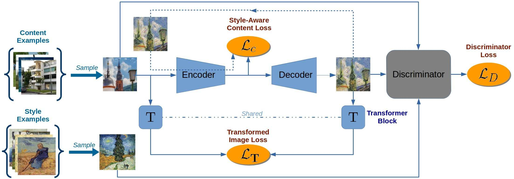

## A Style-Aware Content Loss for Real-time HD Style Transfer
### Artsiom Sanakoyeu*, Dmytro Kotovenko*, Sabine Lang, Björn Ommer, In ECCV 2018 (Oral)
[Website](https://compvis.github.io/adaptive-style-transfer) [Paper](https://arxiv.org/abs/1807.10201) [Code](https://github.com/CompVis/adaptive-style-transfer)

## Result
---
 

## Approach
---

* Discriminator Loss
    * To train $E$ and $G$ we employ a standard adversarial discriminator $D$ to
distinguish the stylized output $G(E(x_i))$ from real examples $y_j ∈ Y$ ,
      > Discriminator Loss
$$ \mathcal{L}_D(E,G,D) = \mathbb{E}_{y \sim \mathcal{p}_{Y(y)}}[logD(y)] +  \mathbb{E}_{x \sim \mathcal{p}_{X(x)}}[log(1 - D(G(E(x))))] $$

* _**Style-Aware**_ Content Loss
  * The details that need to be retained or ignored in $z$ ($z$ = $E(x)$) depend on the style. -> _Style-Aware_
  * So, a pre-trained network or fixed similarity measure for measring the similarity in content between $x_i$ and $y_i$ is violating the art historical premise that the manner, in which content is preserved, depends on the style.
  * Therefore, when measuring the similarity in content between input image $x_i$ and the stylized image $y_i = G(E(x_i))$ in the latent space, we focus only on those details which are relevant for the style.
    > Style-Aware Content Loss
$$ \mathcal{L}_c(E,G) = \mathbb{E}_{x \sim \mathcal{p}_{X(x)}}[ \frac{1}{d} {‖E(x) - E(G(E(x)))‖}_{2}^2 ]$$
Let the latent space have $d$ dimensions.

* Transformed Image Loss
  * Computing the difference between $x_i$ and $y_i$ in RGB space would impose a high penaly for any changes in image strcture between input $x_i$ and output $y_i$, because it relies only on low-level pixel information. `It is untrainable`
  * We aim to learn image stylization and want the encoder to discard certain details in the content depending on style. `It should be trainable`
  * So weak image transformationon $x_i$ and $y_i$, which is learned while learning $E$ and $G$. $T$ is a transformer block which is essentially a one-layer fully convolutional neural network taking an image as input and producing a transformed image of the same size.
      > Transformed Image Loss
 $$ \mathcal{L}_T(E,G) = \mathbb{E}_{x \sim \mathcal{p}_{X(x)}}[\frac{1}{CHW} ‖T(x) - T(G(E(x))) ‖_2^2]$$

> Full Objective model
$$ \mathcal{L}(E,G,D) = \mathcal{L}_c(E,G) + \mathcal{L}_t(E,G) + \lambda \mathcal{L}(E,G,D) $$

> Optimization
$$ E,G = \arg \min_{E,G} \max_D \mathcal{L}(E,G,D) $$

## Conclusions
---
1.Model that enables sets of style images
2.Preserve content in style specific manner ➜ **Style-aware content loss**
3.Fast HD video style transfer w/o temporal smoothing `Wait to read`
4.New metric for quantitative evaluation of style transfer `Wait to read`